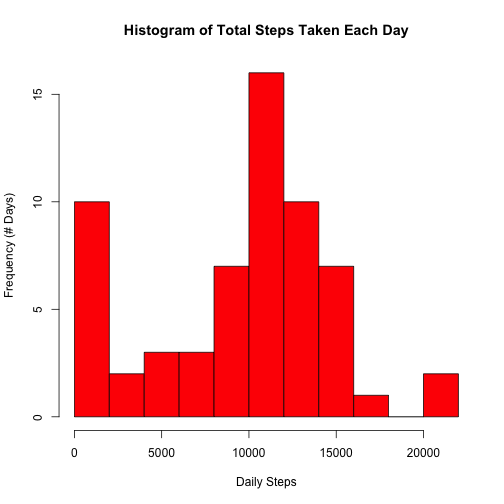

Reproducible Research: Peer Assessment 1
========================================
Submitted by: ppgmg

Required packages to run scripts: **dplyr**, **lattice**

This assignment makes use of data from a personal activity monitoring device. This device collects data at 5 minute intervals through out the day. The data consists of two months of data from an anonymous individual collected during the months of October and November, 2012 and include the number of steps taken in 5 minute intervals each day.

The data used to generate this report was downloaded from the course web site, at the URL provided, on Thu Dec 11 23:11:46 2014.


## Loading and preprocessing the data

First, I included in my script several commands to automatically downloaded the dataset into memory, and extract the *activity.csv* file from the ZIP file. The data was loaded into the object *data*, and I browsed the first few entries of the dataset:


```r
temp <- tempfile()
download.file("https://d396qusza40orc.cloudfront.net/repdata%2Fdata%2Factivity.zip", temp, method="curl")
data <- read.csv(unz(temp,"activity.csv"))
unlink(temp)

head(data)
```

```
##   steps       date interval
## 1    NA 2012-10-01        0
## 2    NA 2012-10-01        5
## 3    NA 2012-10-01       10
## 4    NA 2012-10-01       15
## 5    NA 2012-10-01       20
## 6    NA 2012-10-01       25
```

Second, since I felt it was more natural to have the steps column after the **date** and **interval** columns, I re-arranged the columns of the data frame accordingly, saving the result in *data2*:


```r
data2 <- data[,c(2,3,1)]

head(data2)
```

```
##         date interval steps
## 1 2012-10-01        0    NA
## 2 2012-10-01        5    NA
## 3 2012-10-01       10    NA
## 4 2012-10-01       15    NA
## 5 2012-10-01       20    NA
## 6 2012-10-01       25    NA
```


## What is mean total number of steps taken per day?

I decided to use the *dplyr* package to answer this question. I defined groups by the **date** variable, and then calculated the total number of steps taken for each date, ignoring NA values. 

I then extracted the values calculated for the total number of steps taken, and plotted a histogram using these values.

I have interpreted the instructions "ignore the missing values in the dataset" to mean that use of the sum function will skip over the NA values. However, this means that if an entire day's data is missing, the total steps for the day **will still be calculated** but will give a total count of zero. 

This assumption may be faulty (I don't know whether someone actually took no steps that day, e.g. sick in bed, and the device records this as NA, or whether the device did not record, e.g. not on, not worn, or out of battery). One possible correction that I could apply is to flag days that have all NA values, and to exclude that day's entry completely when plotting the histogram and calculating mean and median. However, for the purpose of this assignment, I have left the count of total steps in for days where all data is NA, at zero. I deal further with NA values later in this assignment.


```r
library(dplyr)
```


```r
## group data by date, then calculate total steps by group
groupdate <- group_by(data2,date)
dailysteps <- summarise(groupdate,total_steps=sum(steps, na.rm=TRUE))

## for plotting purposes, extract vector of daily total_steps values
##
## I chose a greater number of bars than the default to get a better
## sense of the shape. This can be changed by adjusting the 'breaks' value.

stepsPlot <- dailysteps$total_steps
hist(stepsPlot, breaks=10, main="Histogram of Total Steps Taken Each Day", xlab="Daily Steps", ylab="Frequency (# Days)", col="red")
```

 

The **mean** and **median** of the values calculated for the total number of steps taken per day were determined to be 9354 (rounded) and 10395, respectively, which appears to be consistent the histogram shown. 


```r
mean(stepsPlot)
```

```
## [1] 9354.23
```

```r
median(stepsPlot)
```

```
## [1] 10395
```


## What is the average daily activity pattern?

When I ran the following function on my original dataset, and specifically looked at the interval values (results suppressed here for brevity):


```r
table(data$interval)
```

it appeared that the interval values ranged from 0 to 2355 in increments of 5, for a total of 288 intervals/entries each day. This makes sense based on the description that indicated the data was being taken at 5-minute intervals. The identifier used appears to be based on time (e.g. hh:mm on a 24-hour clock), although it is unknown from the provided data set and documentation whether the time represents the beginning of the interval or the end of the interval.

Since each day's data include a record for each of the 288 time intervals, I re-used the earlier computed processed data set, but this time I defined groups by the **interval** variable. 

I then calculated the average number of steps taken for each interval, ignoring NA values, taken across all days, and then stored and illustrated the results in a time series plot: *average steps for a given interval on the y-axis, and the corresponding time interval on the x-axis.* 


```r
## group data by interval, then calculate average steps by group
groupinterval <- group_by(data2,interval)
avgsteps <- summarise(groupinterval,avg_steps=mean(steps, na.rm=TRUE))

plot(avgsteps$interval,avgsteps$avg_steps, type="l", main="Average Number of Steps in a Given Interval", xlab="Time Interval (hhmm)", ylab="Steps", xaxp=c(0,2400,24))
```

 

The time series plot suggests that the maximum number of steps, on average all over all days in the data set, occurs in an interval between 800 and 900, or between 8 a.m. and 9 a.m. in the morning. This makes sense as this person is probably the most active when waking up (e.g. getting ready to go to work in the morning).

I calculated the **exact interval with the maximum value of average steps** using the *which.max* function:


```r
## get the row index containing the maximum value in the avg_steps column
## then retrieve the value in the interval column with the same index
peakstepinterval <- avgsteps$interval[which.max(avgsteps$avg_steps)]
peakstepinterval
```

```
## [1] 835
```

This represents an interval beginning (or ending) at 8:35 a.m.


## Imputing missing values

As previously noted, the presence of missing days may have introduced some bias into previous calculations or summaries of the data. In particular, when all the data for a day is recorded as NA, the *total* function calculated the total number of steps for that day as zero (rather than setting the total as "NA"). However, this means that the mean and median measures calculated earlier are likely lower than their true values.

I had suggested we could remove these days completely from consideration when calculating the mean and median of total daily steps. Alternatively, we can fill in the missing values in the data set, as required by the assignment.

To get an idea of how the NAs were dispersed in the data set, I ran a series of functions *all(is.na(steps))*, *sum(is.na(steps))*, and *any(is.na(steps))* on the dataset with the data grouped by *date*, and then analysed the results:


```r
## show NA information by date
dailysteps2 <- summarise(groupdate,total_steps=sum(steps, na.rm=TRUE), allNA=all(is.na(steps)), sumNA=sum(is.na(steps)), anyNA=any(is.na(steps)))
dailysteps2
```

```
## Source: local data frame [61 x 5]
## 
##          date total_steps allNA sumNA anyNA
## 1  2012-10-01           0  TRUE   288  TRUE
## 2  2012-10-02         126 FALSE     0 FALSE
## 3  2012-10-03       11352 FALSE     0 FALSE
## 4  2012-10-04       12116 FALSE     0 FALSE
## 5  2012-10-05       13294 FALSE     0 FALSE
## 6  2012-10-06       15420 FALSE     0 FALSE
## 7  2012-10-07       11015 FALSE     0 FALSE
## 8  2012-10-08           0  TRUE   288  TRUE
## 9  2012-10-09       12811 FALSE     0 FALSE
## 10 2012-10-10        9900 FALSE     0 FALSE
## 11 2012-10-11       10304 FALSE     0 FALSE
## 12 2012-10-12       17382 FALSE     0 FALSE
## 13 2012-10-13       12426 FALSE     0 FALSE
## 14 2012-10-14       15098 FALSE     0 FALSE
## 15 2012-10-15       10139 FALSE     0 FALSE
## 16 2012-10-16       15084 FALSE     0 FALSE
## 17 2012-10-17       13452 FALSE     0 FALSE
## 18 2012-10-18       10056 FALSE     0 FALSE
## 19 2012-10-19       11829 FALSE     0 FALSE
## 20 2012-10-20       10395 FALSE     0 FALSE
## 21 2012-10-21        8821 FALSE     0 FALSE
## 22 2012-10-22       13460 FALSE     0 FALSE
## 23 2012-10-23        8918 FALSE     0 FALSE
## 24 2012-10-24        8355 FALSE     0 FALSE
## 25 2012-10-25        2492 FALSE     0 FALSE
## 26 2012-10-26        6778 FALSE     0 FALSE
## 27 2012-10-27       10119 FALSE     0 FALSE
## 28 2012-10-28       11458 FALSE     0 FALSE
## 29 2012-10-29        5018 FALSE     0 FALSE
## 30 2012-10-30        9819 FALSE     0 FALSE
## 31 2012-10-31       15414 FALSE     0 FALSE
## 32 2012-11-01           0  TRUE   288  TRUE
## 33 2012-11-02       10600 FALSE     0 FALSE
## 34 2012-11-03       10571 FALSE     0 FALSE
## 35 2012-11-04           0  TRUE   288  TRUE
## 36 2012-11-05       10439 FALSE     0 FALSE
## 37 2012-11-06        8334 FALSE     0 FALSE
## 38 2012-11-07       12883 FALSE     0 FALSE
## 39 2012-11-08        3219 FALSE     0 FALSE
## 40 2012-11-09           0  TRUE   288  TRUE
## 41 2012-11-10           0  TRUE   288  TRUE
## 42 2012-11-11       12608 FALSE     0 FALSE
## 43 2012-11-12       10765 FALSE     0 FALSE
## 44 2012-11-13        7336 FALSE     0 FALSE
## 45 2012-11-14           0  TRUE   288  TRUE
## 46 2012-11-15          41 FALSE     0 FALSE
## 47 2012-11-16        5441 FALSE     0 FALSE
## 48 2012-11-17       14339 FALSE     0 FALSE
## 49 2012-11-18       15110 FALSE     0 FALSE
## 50 2012-11-19        8841 FALSE     0 FALSE
## 51 2012-11-20        4472 FALSE     0 FALSE
## 52 2012-11-21       12787 FALSE     0 FALSE
## 53 2012-11-22       20427 FALSE     0 FALSE
## 54 2012-11-23       21194 FALSE     0 FALSE
## 55 2012-11-24       14478 FALSE     0 FALSE
## 56 2012-11-25       11834 FALSE     0 FALSE
## 57 2012-11-26       11162 FALSE     0 FALSE
## 58 2012-11-27       13646 FALSE     0 FALSE
## 59 2012-11-28       10183 FALSE     0 FALSE
## 60 2012-11-29        7047 FALSE     0 FALSE
## 61 2012-11-30           0  TRUE   288  TRUE
```

```r
## calculate total number of NA entries
totalNA <- sum(dailysteps2$sumNA)
totalNA
```

```
## [1] 2304
```

The sum of the values in the sumNA column, stored in *totalNA*, represents the **total number of rows with NA values** in the steps column: **2304 steps**.

However, what was more interesting is that for each day where there was at least one NA entry, **all** the data entries for that day were NA. In other words, there was either complete data or incomplete data for each day; there were no days where the dataset was only partially complete.

With knowledge of this property, **one strategy for filling in the missing values in this dataset is to use the average steps per interval** calculated in the previous part of the assignment; the average number of steps for a given interval within a day can be used as the value for the corresponding interval in the missing day's data. Effectively, this strategy will work best if the subject's step patterns throughout a given day is generally consistent across all days represented by the data.  

Since I do not know anything about the subject, this is probably as good an assumption as any; however, I could have considered some alternative strategies, such as using the average steps per interval averaged over a small number of preceding and/or successive days (e.g. +/- 3 days) rather than the whole dataset (on the assumption that the person's step patterns are probably not that different within a small grouping of days). As a further alternative, we could use average steps per interval averaged over the same day of the week (e.g. if the day with the missing value is a Saturday, then use average steps per interval averaged over only Saturdays), which assumes that a person's step patterns may be highly dependent on the day of the week.

In any event, for the purpose of this assignment, I used the previous calculated average steps per interval, and inserted those values into the original dataset for each day with complete missing data. **The new dataset** was stored in *data3*. Note that I inserted each value for average steps per interval as-is (without rounding), as I did not see the need to round off these numbers arbitrarily, given that the sole purpose is to artificially fill in missing NA values.


```r
## within 'data', if the value for steps is NA, then replace with
## corresponding value within the avg_steps column in the 'avgsteps' table
## otherwise, leave value as is, then save new data table as 'data3'
## note: fractional steps permitted

data3 <- within(data, steps <- ifelse(is.na(steps),avgsteps$avg_steps,steps))

head(data3)
```

```
##       steps       date interval
## 1 1.7169811 2012-10-01        0
## 2 0.3396226 2012-10-01        5
## 3 0.1320755 2012-10-01       10
## 4 0.1509434 2012-10-01       15
## 5 0.0754717 2012-10-01       20
## 6 2.0943396 2012-10-01       25
```

```r
tail(data3)
```

```
##           steps       date interval
## 17563 2.6037736 2012-11-30     2330
## 17564 4.6981132 2012-11-30     2335
## 17565 3.3018868 2012-11-30     2340
## 17566 0.6415094 2012-11-30     2345
## 17567 0.2264151 2012-11-30     2350
## 17568 1.0754717 2012-11-30     2355
```

It appears the NA values have been successfully replaced with the average step values calculated in the earlier question.

I now re-plot a histogram of the steps taken each day, and, using *data3* (a dataset with no more NA values), re-calculate the mean and median (unlike the inserted data, I rounded the computed median to the nearest step, to avoid small fractions of a step being used for this summary statistic):


```r
## group data (with no NAs) by date, then calculate total steps by group
groupdateNoRM <- group_by(data3,date)
dailystepsNoRM <- summarise(groupdateNoRM,total_stepsNoNA=sum(steps))

## for plotting purposes, extract vector of daily total_steps values
## I chose a greater number of bars than the default to get a better
## sense of the shape. This can be changed by adjusting the 'breaks' value

stepsPlotNoRM <- dailystepsNoRM$total_stepsNoNA
hist(stepsPlotNoRM, breaks=10, main="Histogram of Total Steps Taken Each Day (revised)", xlab="Daily Steps", ylab="Frequency (# Days)", col="red")
```

 


```r
mean(stepsPlotNoRM)
```

```
## [1] 10766.19
```

```r
formatC(median(stepsPlotNoRM),digits=0,format="f")
```

```
## [1] "10766"
```

**Original Dataset**

- mean: 9354 steps (rounded) 
- median: 10395 steps

**Revised Dataset**

- mean: 10766 steps (rounded)
- median: 10766 steps (rounded)

The mean and median measures do differ slightly between the two data sets; in particular, with the NA values filled in, there are no more "zero-step" days, which results in an increase in both of the individual mean and the median total step values. Intuitively, there are less zero values "pulling down" the value of the computed measures, and in particular, the mean. 

Furthermore, since I am inserting sets of "average" values into the dataset, the average is predictably inflated (I note the height of the histogram's peak has increased), and it is no surprise that the data is less skewed, with the mean now much closer in value to the median using the revised dataset.

Nevertheless, as previously noted, this does not necessarily imply that the computed measures are more *accurate* -- it may be that the use of the average step count per interval to fill in a missing day's data is, potentially, a gross underestimate or overestimate of the actual number of steps taken in the corresponding interval for that day.


## Are there differences in activity patterns between weekdays and weekends?

I used the *data3* table with the NA values replaced, and **created a new factor variable** (*daytype*) in the dataset with two levels – “weekday” and “weekend” indicating whether a given date is a weekday or weekend day.


```r
## add variable daytype to store the day of the week (e.g. "Monday",etc.)
dayofweek <- mutate(data3, daytype=(weekdays(as.Date(date))))

## convert "Monday", "Tuesday", etc. to "weekday"
## and "Saturday" and "Sunday" to "weekend" in the table
dayofweek <- within(dayofweek, daytype <- ifelse(daytype=="Monday"|daytype=="Tuesday"|daytype=="Wednesday"|daytype=="Thursday"|daytype=="Friday","weekday",daytype))
dayofweek <- within(dayofweek, daytype <- ifelse(daytype=="Saturday"|daytype=="Sunday","weekend",daytype))

## coerce daytype into type 'factor'
dayofweek$daytype <- as.factor(dayofweek$daytype)

table(dayofweek$daytype)
```

```
## 
## weekday weekend 
##   12960    4608
```

I then constructed a panel plot containing a time series plot of the 5-minute interval (x-axis) and the average number of steps taken, averaged across all weekday days or weekend days (y-axis).


```r
library(lattice)
```


```r
## group day by interval, and then further by daytype
groupintervalANDdaytype <- group_by(dayofweek,interval,daytype)

## calculate average by interval AND daytype
avgsteps2 <- summarise(groupintervalANDdaytype,avg_steps=mean(steps))

## construct panel plot 
## weekend data in one panel and weekday data in the other panel
xyplot(avg_steps~interval | factor(daytype), data=avgsteps2, main="Average Number of Steps in a Given Interval", xlab="Time Interval (hhmm)",  ylab="Steps",layout=c(1,2),type="l",scales=list(x=list(at=seq.int(0,2400,length.out=25),rot=90)))
```

 

There do appear to be some differences in activity patterns between weekdays and weekend days. Although it appears the subject wakes up around the same time on weekend days (e.g. as opposed to sleeping in), there are fewer steps taken in that wake-up period. Perhaps this means the subject is less active in the mornings on days in which he or she does not need to attend work or school. The higher number of steps during the day on weekends might also suggest that this subject has a sedentary (e.g. office) job during the week.
